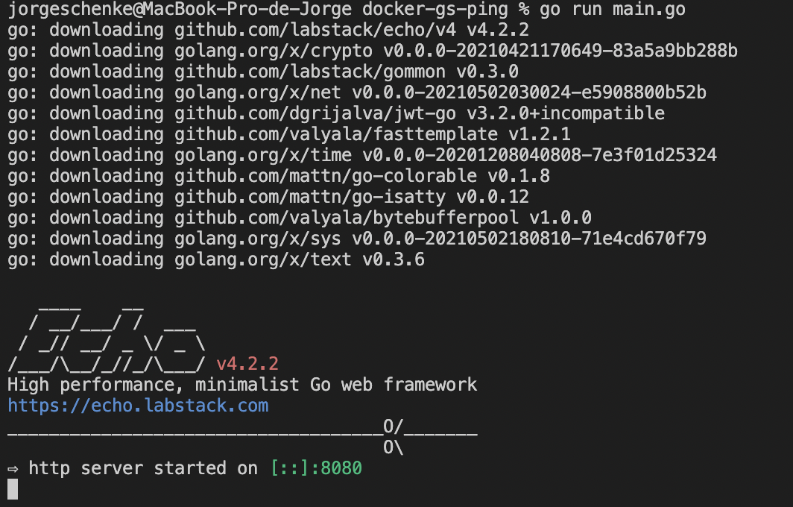
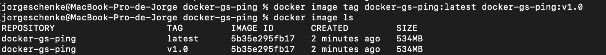

# Parte 1
## Constrrucción de imagen en docker
Luego de instalar docker, lo primero que hicimos fue clonar el repositorio público que nos entrega la documentación en el tutorial:

Una vez clonado el repositorio, cremamos el Dockerfile con las especificaciones del build, que eran las siguientes:<br>
```
FROM node:12-alpine
RUN apk add --no-cache python2 g++ make
WORKDIR /app
COPY . .
RUN yarn install --production
CMD ["node", "src/index.js"]
EXPOSE 3000
```
Una vez configurado, corrimos docker build para crear la imagen:

Con nuesta imagen ya creada, fuimos capaces de correr la app:


## Compartiendo la app:
Una vez funcionando la app, comenzamos el proceso para poder compartirla:<br>
Primero, nos creamos un usuario de Docker Hub.<br>
Después, creamos un nuevo repositorio público.<br>
Una vez creado, subimos nuestra aplicación al repo, para lo cual tuvimos que crear un tag para la imagen:


Finalmente, pudimos pushear la imagen al repo y correrla en una máquina remota:


## Múltiples contenedores + BDD
En primer lugar, creamos la network que contendría el container con la app y la BDD:

Luego, iniciamos una BDD MySQL, y la agregamos al network:

Y verificamos que la BDD se haya creado correctamente:

Para correr la app en el mismo container, primero debemos encontrarlo, para lo cual utilizamos un container externo:

Y buscamos la IP del container que contiene la BDD:


## Docker compose
Primero, creamos nuestro docker-compose.yml y le agregamos el siguiente contenido:
```
version: "3.7"

services:
  app:
    image: node:12-alpine
    command: sh -c "yarn install && yarn run dev"
    ports:
      - 3000:3000
    working_dir: /app
    volumes:
      - ./:/app
    environment:
      MYSQL_HOST: mysql
      MYSQL_USER: root
      MYSQL_PASSWORD: secret
      MYSQL_DB: todos

  mysql:
    image: mysql:5.7
    volumes:
      - todo-mysql-data:/var/lib/mysql
    environment:
      MYSQL_ROOT_PASSWORD: secret
      MYSQL_DATABASE: todos

volumes:
  todo-mysql-data:
```
Una vez configurado, corremos con compose:

Podemos checkear que tanto la app como la BDD estén corriendo:

Y cerrar el compose:


# Parte 2
## Corriendo app
Una vez clonada la app pública que nos entrega el tutorial, corrimos su script principal:

Podemos hacer una request de prueba a la app utilizando curl:

Ahora que confirmamos que la app funciona, utilizaremos la imagen que nos proporciona Docker especialmente para correr apps en Go, el Dockerfile se verá de la siguiente forma:
```
# syntax=docker/dockerfile:1
# syntax=docker/dockerfile:1

# Alpine is chosen for its small footprint
# compared to Ubuntu
FROM golang:1.16-alpine

WORKDIR /app

# Download necessary Go modules
COPY go.mod ./
COPY go.sum ./
RUN go mod download

# ... the rest of the Dockerfile is ...
# ...   omitted from this example   ...
```
Ahora, podemos contruir nuestra imagen:

Y confirmar que se haya creado correctamente:

Luego, creamos un tag para la imagen lo cual hará más simple referirnos a ella:

## Multistage building
Podemos reducir el tamaño de nuestra imagen especificando las herramientas de Go justas y necesarias para nuestra app. Para eso, creamos un Dockerfile.multistage con el siguiente contenido:
```
# syntax=docker/dockerfile:1

## Build
FROM golang:1.16-buster AS build

WORKDIR /app

COPY go.mod ./
COPY go.sum ./
RUN go mod download

COPY *.go ./

RUN go build -o /docker-gs-ping

## Deploy
FROM gcr.io/distroless/base-debian10

WORKDIR /

COPY --from=build /docker-gs-ping /docker-gs-ping

EXPOSE 8080

USER nonroot:nonroot

ENTRYPOINT ["/docker-gs-ping"]
```
Y construimos la imagen con el Docker.multistage que creamos:

Podemos confirmar la creación de la imagen listando las mismas:

## Correr contenedor con nuestra imagen
Una vez creada la imagen correctamente, podemos correr el contenedor con el siguiente comando:

Donde la consola nos indica que el contenedor está corriendo.<br>
Podemos hacer una request ```GET``` de prueba con curl:

## Corriendo app en el background
Para correr nuestra app en el background, y que no necesitemos que una terminal esté abierta corriéndola, podemos correrla con el modo detached:

Podemos confirmar la existencia del container:

Y detener la app:

También podemos volver a iniciarla con el comando restart:

## Creando volúmenes
El objetivo de los volúmenes es contener las BBDD que almacenen información consistente para nuestra app, podemos crear un volumen corriendo:
```
docker volume create roach
```
Y podemos chequear la creación correcta del volumen:
```
docker volume list
```
Lo cual contesta lo siguiente:

## Networking
Una vez listas la app y el volumen de la BDD, crearemos una network por la cual podrán comunicarse con el comando:
```
docker network create -d bridge mynet
```
Podemos listas las network para confirmar que fue creada:

## Corriendo la BDD
Una vez lista la app, la BDD y la network, podemos correr la BDD con el siguiente comando:

Y luego crear la base de datos MYSQl, registrar un nuevo usuario y darle permisos a este:


## Corriendo la app:
Docker tiene una app de ejemplo que clonamos y podemos buildear y correr:


Podemos confirmar que se corrió de forma exitosa:

Podemos testear la app con curl:

## Corriendo con compose:
Podemos utilizar compose para simplificar los comandos de docker y correr nuestra app de forma más eficiente, para esto, agregamos el siguiente contenido al archivo docker-compose.yml:
```
version: '3.8'

services:
  docker-gs-ping-roach:
    depends_on: 
      - roach
    build:
      context: .
    container_name: rest-server
    hostname: rest-server
    networks:
      - mynet
    ports:
      - 80:8080
    environment:
      - PGUSER=${PGUSER:-totoro}
      - PGPASSWORD=${PGPASSWORD:?database password not set}
      - PGHOST=${PGHOST:-db}
      - PGPORT=${PGPORT:-26257}
      - PGDATABASE=${PGDATABASE:-mydb}
    deploy:
      restart_policy:
        condition: on-failure
  roach:
    image: cockroachdb/cockroach:latest-v20.1
    container_name: roach
    hostname: db
    networks:
      - mynet
    ports:
      - 26257:26257
      - 8080:8080
    volumes:
      - roach:/cockroach/cockroach-data
    command: start-single-node --insecure

volumes:
  roach:

networks:
  mynet:
    driver: bridge
```
Luego, corremos la app con el comando:
```
docker-compose up --build -d

```
Y finalmente, la probamos con curl:

