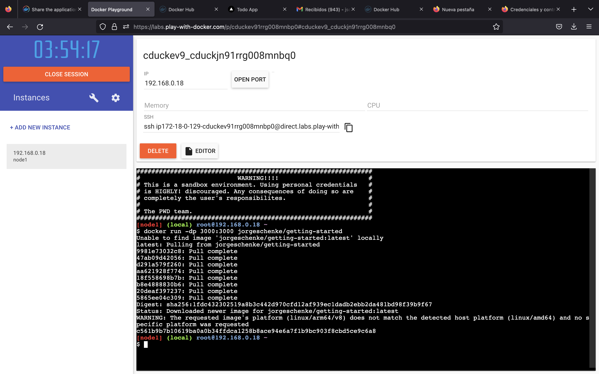
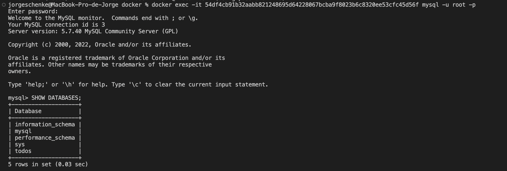
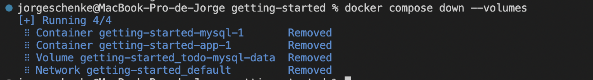

# Parte 1
## Constrrucción de imagen en docker
Luego de instalar docker, lo primero que hicimos fue clonar el repositorio público que nos entrega la documentación en el tutorial:

Una vez clonado el repositorio, cremamos el Dockerfile con las especificaciones del build, que eran las siguientes:<br>
```
FROM node:12-alpine
RUN apk add --no-cache python2 g++ make
WORKDIR /app
COPY . .
RUN yarn install --production
CMD ["node", "src/index.js"]
EXPOSE 3000
```
Una vez configurado, corrimos docker build para crear la imagen:

Con nuesta imagen ya creada, fuimos capaces de correr la app:


## Compartiendo la app:
Una vez funcionando la app, comenzamos el proceso para poder compartirla:<br>
Primero, nos creamos un usuario de Docker Hub.<br>
Después, creamos un nuevo repositorio público.<br>
Una vez creado, subimos nuestra aplicación al repo, para lo cual tuvimos que crear un tag para la imagen:


Finalmente, pudimos pushear la imagen al repo y correrla en una máquina remota:



## Múltiples contenedores + BDD
En primer lugar, creamos la network que contendría el container con la app y la BDD:

Luego, iniciamos una BDD MySQL, y la agregamos al network:

Y verificamos que la BDD se haya creado correctamente:

Para correr la app en el mismo container, primero debemos encontrarlo, para lo cual utilizamos un container externo:

Y buscamos la IP del container que contiene la BDD:


## Docker compose
Primero, creamos nuestro docker-compose.yml y le agregamos el siguiente contenido:
```
version: "3.7"

services:
  app:
    image: node:12-alpine
    command: sh -c "yarn install && yarn run dev"
    ports:
      - 3000:3000
    working_dir: /app
    volumes:
      - ./:/app
    environment:
      MYSQL_HOST: mysql
      MYSQL_USER: root
      MYSQL_PASSWORD: secret
      MYSQL_DB: todos

  mysql:
    image: mysql:5.7
    volumes:
      - todo-mysql-data:/var/lib/mysql
    environment:
      MYSQL_ROOT_PASSWORD: secret
      MYSQL_DATABASE: todos

volumes:
  todo-mysql-data:
```
Una vez configurado, corremos con compose:

Podemos checkear que tanto la app como la BDD estén corriendo:

Y cerrar el compose:
