Crear un clúster Kubernetes.

- Se deployea un cluster de kubernetes local usando minikube, utilizando un ambiente de linux.

- Primero checkeamos que minikube esté instalado (viendo la versión con "minikube version") y luego prendemos el cluster con "minikube start"), lo que creará un cluster en la terminal web creando una instancia de maquina virtual.

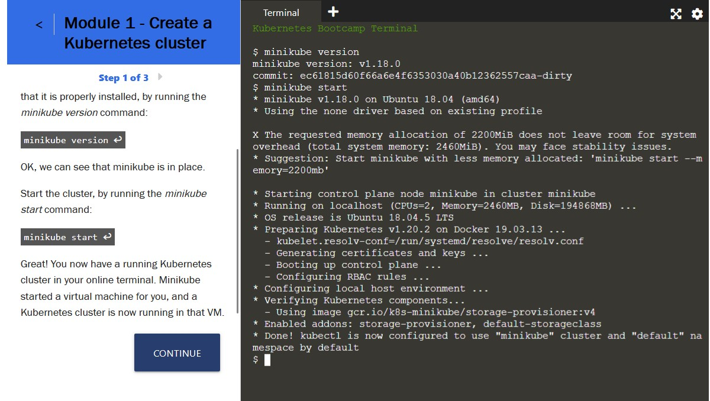

- Luego checkeamos la version de kubectl, vemos detalles del cluster y también vemos los nodos. Donde vemos que tenemos minikube corriendo y con status ready.

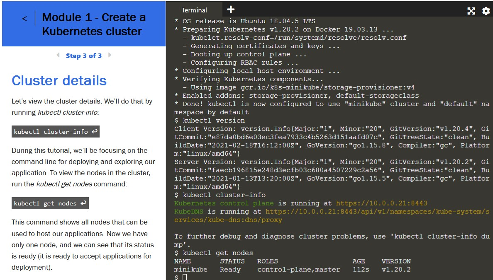

• Desplegar una app.

- Deployaremos una app usando kubectl.

-Primero checkeamos que kubectl este instalado correctamente, con los ultimos comandos del paso anterior.

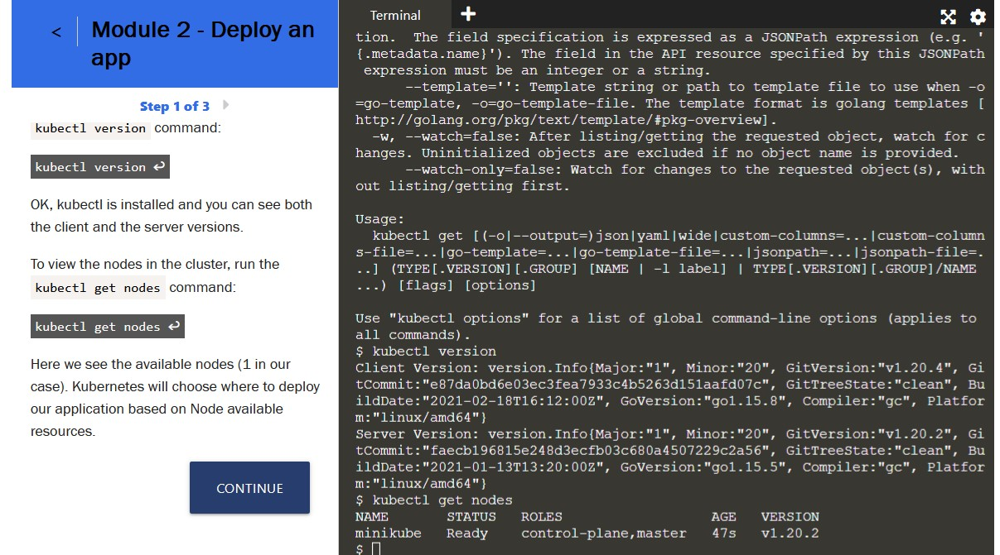

- Ahora procedemos a crear el deployment con "kubectl create deployment" y seleccionando una imagen, esto busca un nodo donde se pueda instanciar la aplicacion, programa la aplicacion para que corra en ese nodo, y configura el cluster para reprogramar la instancia en un nuevo nodo si es necesario.

Luego para confirmar el deploys hacemos get deployments.

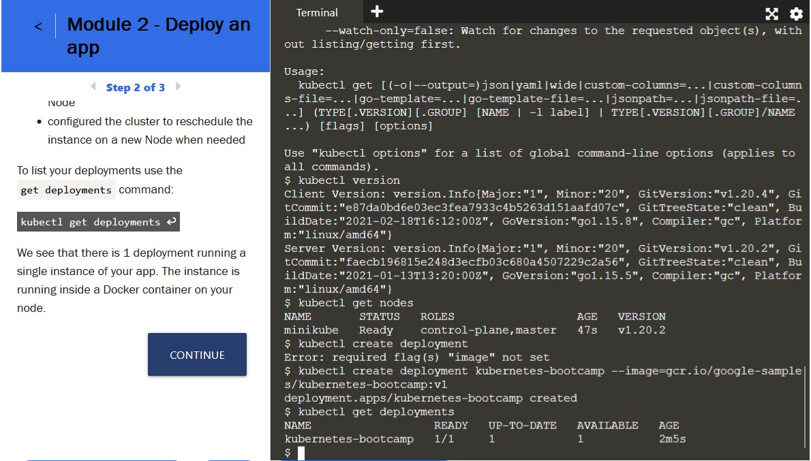

Ahora visualizaremos nuestra app, para ello crearemos un proxy con kubectl para conectar nuestro host con el cluster de kubernetes. Con el proxy tenemos acceso mediante API desde la terminal a la app.

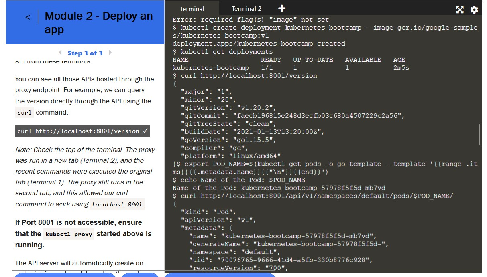

Para el acceso mediante la API, vemos que el endpoint tiene de nombre, el nombre del pod, y luego podemos acceder al endpoint, ya que se le asigna un nombre automaticamente.

• Troubleshoot Kubernetes (get, describe, logs y exec).

Veremos como debuggear kubernetes, o revisar el status de nuestro cluster.

Primero veremos que la aplicación esté deployada con kubectl get.

Podemos ver tambien las imagenes de los pods con "describe"

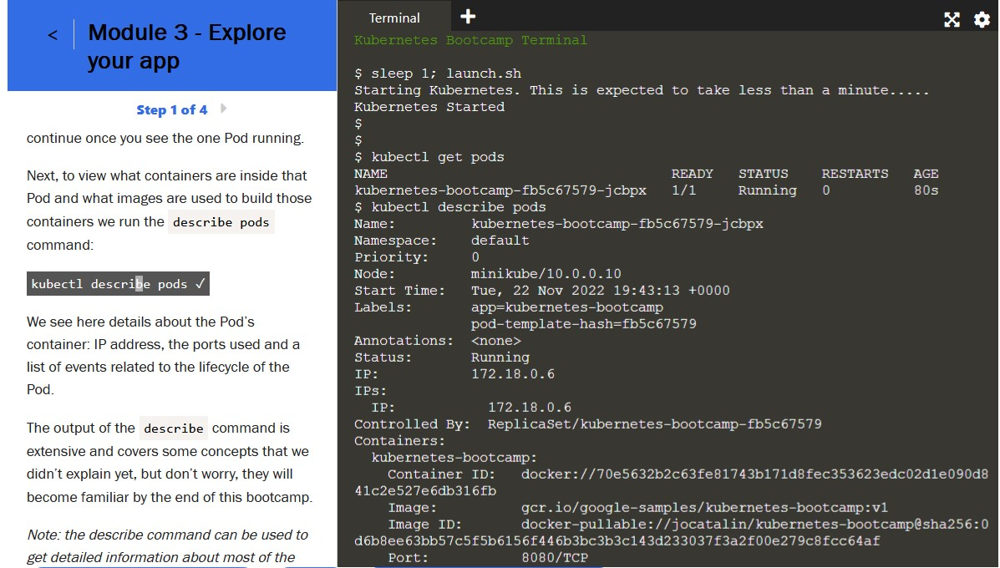

Ahora arrancamos un proxy para nuestro Pod y poder debuggearlo.

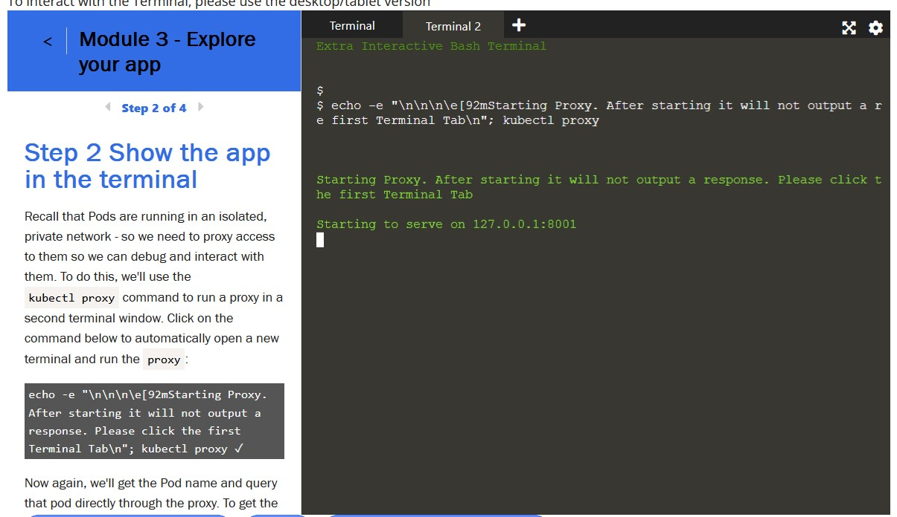

Luego creamos una variable de ambiente con el nombre del pod para luego poder acceder a la ruta API del pod.

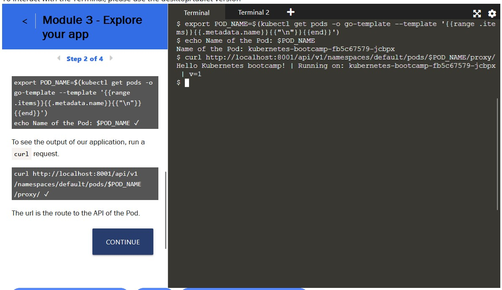

Podemos ver todo lo que la app mostraría como STDOUT con kubectl logs, ya que se convierte en un log para el container.

Podemos ejecutar comandos en el Pod con "exec", por ejemplo para ver las variables de ambiente del pod. Y abriremos una terminal en el pod con --bash, luego podemos por ejemplo, pedir el codigo del file server.js con cat server.js, ya que estamos en el contenedor de la app. Checkeamos que la app esté corriendo y luego podemos salir de la conexion del contenedor con exit.

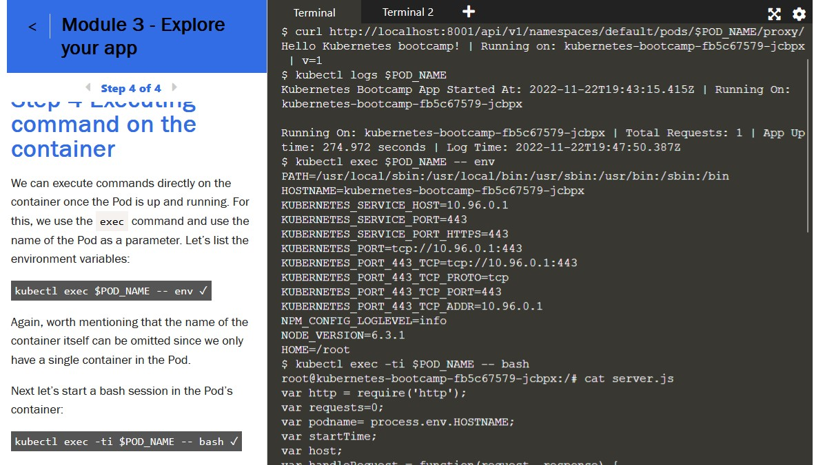
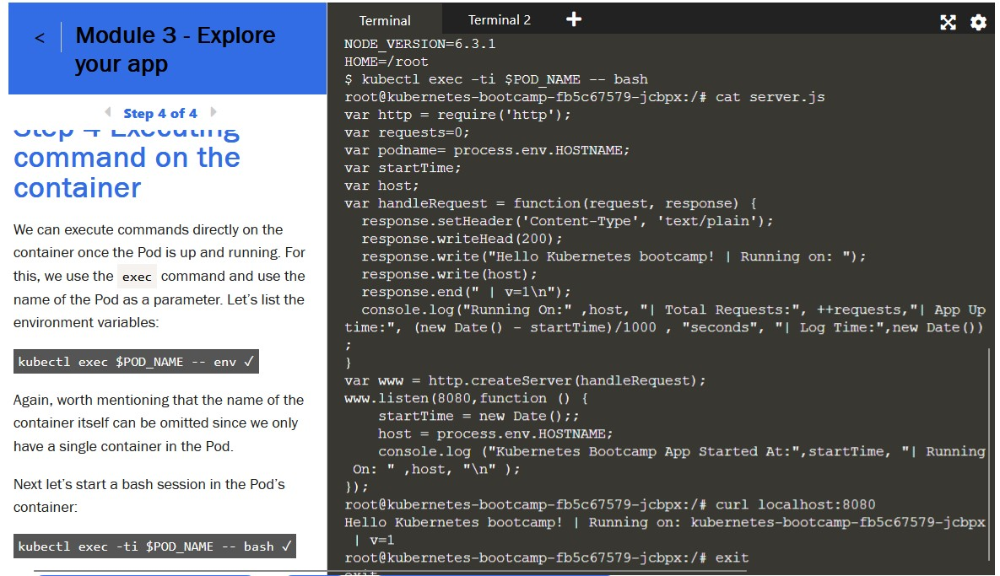

• Exponer una aplicación públicamente.

Usaremos "Service" para exponer nuestra app fuera del cluster de kubernetes.

Para esto primero obtenemos los pods, y los servicios actuales, vemos que tenemos un servicio por default dado por minikube,  pero crearemos un nuevo servicio y lo expondremos con nodeport.
Luego obtenemos los servicios nuevamente y vemos que se encuentra corriendo.

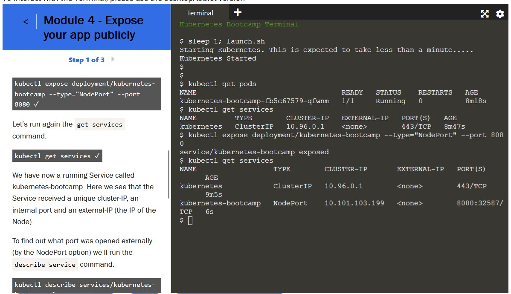

Luego podemos obtener el puerto y la IP con get services y luego con el comando describe obtenemos el puerto.
Asignamos el valor del puerto a una variable de environment, y luego hacemos curl a la ip del minikube con el valor del puerto. y vemos que tenemos el servicio expuesto correctamente al recibir una respuesta.

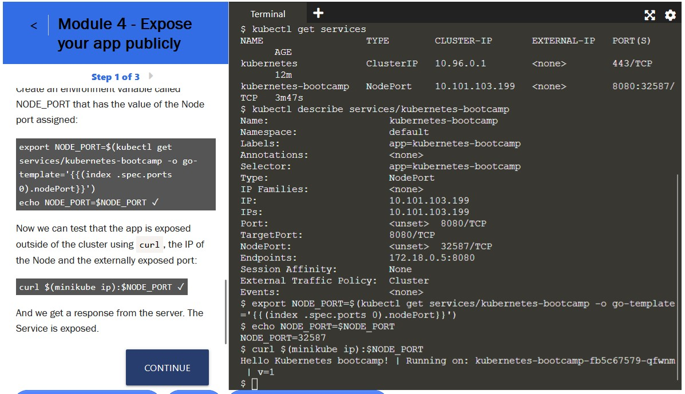

Ahora veremos como asignar labels a nuestro pod

Vemos el nombre del label con describe deployment

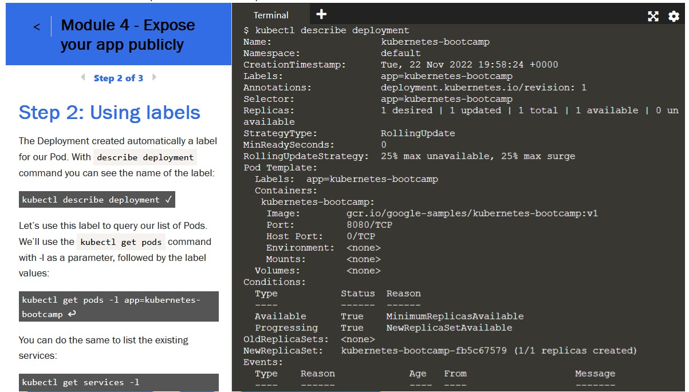

Y podemos usar get pods con el label, y lo mismo para listar los servicios con el nombre del label.
Asignamos el nombre del label a una variable de environment.
Y asignamos un nuevo label con "label pods", ahora vemos que nuestro pod tiene el nuevo label usando describe, y que tambien podemos hacer get con el nuevo label para obtener el pod.

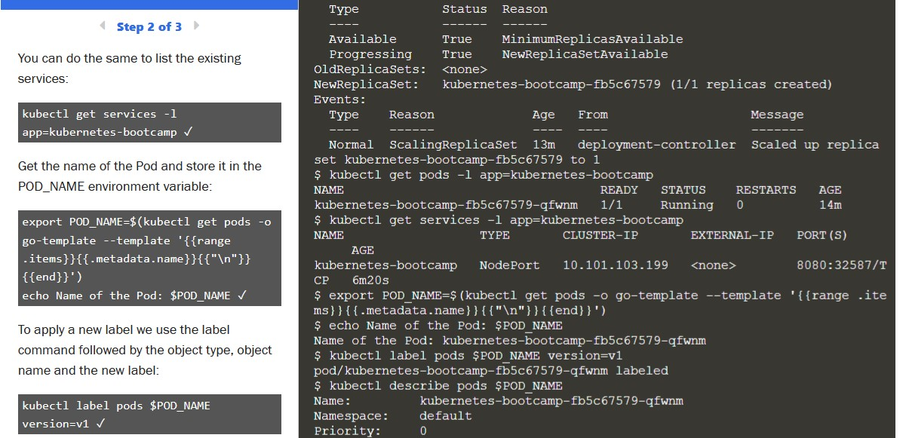
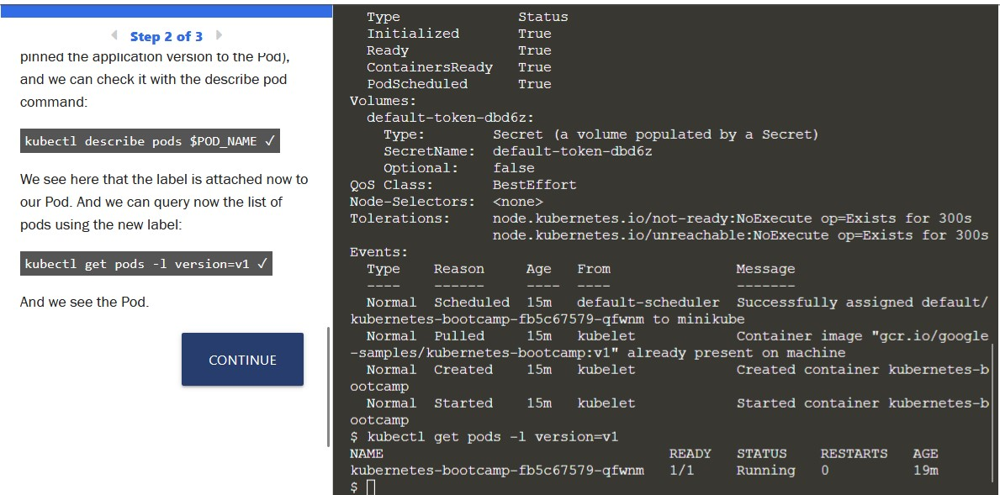

Para borrar un servicio usaremos delete service, y confirmamos que se elimino con get services y luego haciendo curl, vemos que no recibimos respuesta desde fuera del pod, pero al hacer exec y luego curl desde el pod, vemos que si tenemos respuesta. Por lo que la app sigue corriendo, pero ya no está expuesta publicamente. 

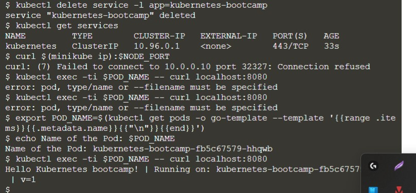

• Escalar una aplicación.

Buscamos escalar nuestro cluster para poder suplir la demanda en caso que sea necesario para nuestra aplicación. Esto se hace cambiando el numero de replicas en un Deployment. Luego con un load balancer el trafico se distribuye en estos Pods.

- Obtenemos los deployments y luego los ReplicaSet.
- Luego cambiamos a 4 replicas, y confirmamos que esten ready con get deployments.
- Luego podemos ver todos los pods disponibles, y que estan asignados con distintas IPS, y podemos ver el cambio con describe.

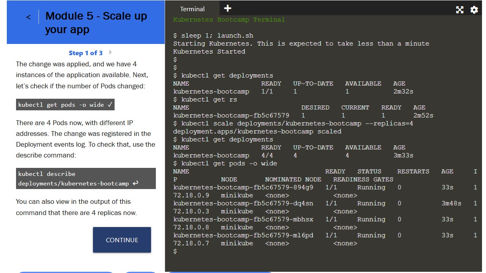

Ahora podemos checkear que este funcionando el load-balancing. Para esto veremos la ip y puerto expuestos del servicio y los asignamos a una variable de ambiente. Y ahora haremos curl al endpoint de la API y veremos que nos responde un POD distinto cada vez. Por lo que el load balancing esta distribuyendo las requests entre los pods.

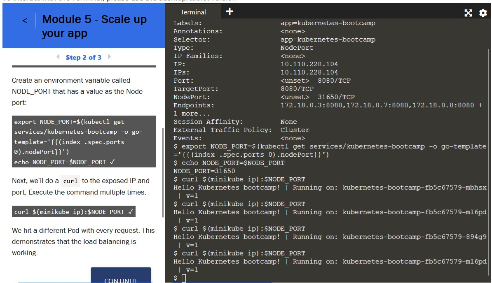

Para reducir la cantidad de PODS o hacer "scale down" es el mismo comando, pero bajando la cantidad de replicas. Ejecutamos los comandos para settear a 2 replicas y luego verificar que solo hayan 2. Vemos que de los 4 pods, 2 estan running y 2 terminandose.

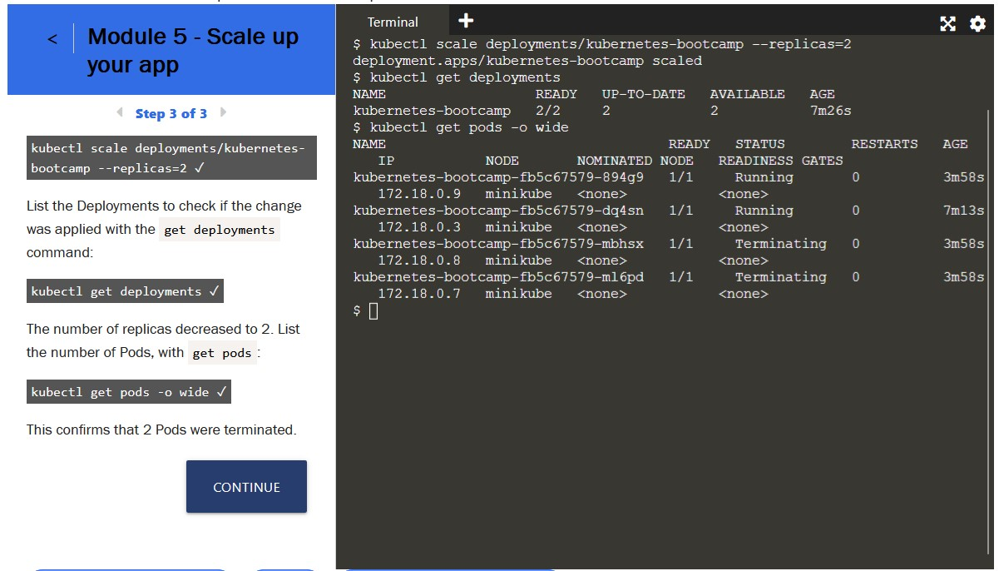

• Actualizar una aplicación.

Implica hacer un rolling update en los Deployments dde kubernets, que permite tener 0 tiempo de baja, actualizando incrementalmente los pods y así nunca teniendo intermitencia de servicio al hacer un update.

La idea es hacer un update de un pod, mientras otros siguen atendiendo, por lo que es requisito tener más de un Pod.

- Partimos obteniendo los deploys y los pods que tenemos, y los describimos para ver la version de la imagen.

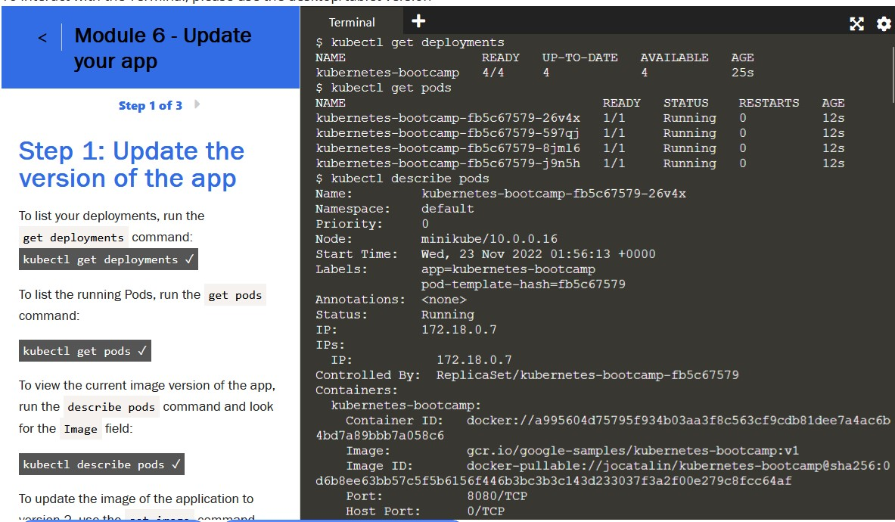

- Ahora realizaremos un update con "set image" actualizandolo a la version 2. y podemos ver como se actualizan los pods a las nuevas versiones, haciendo un rolling update, lo que creo 4 pods más mientras los otros 4 seguian sirviendo, y luego son reemplazados y quedan solo 4 finalmente.

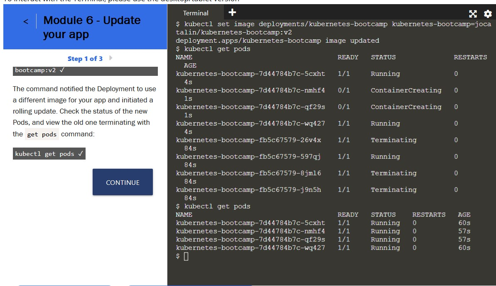

Checkearemos que el update se haya hecho, haciendo curl a la API, y vemos que nos responde con v2

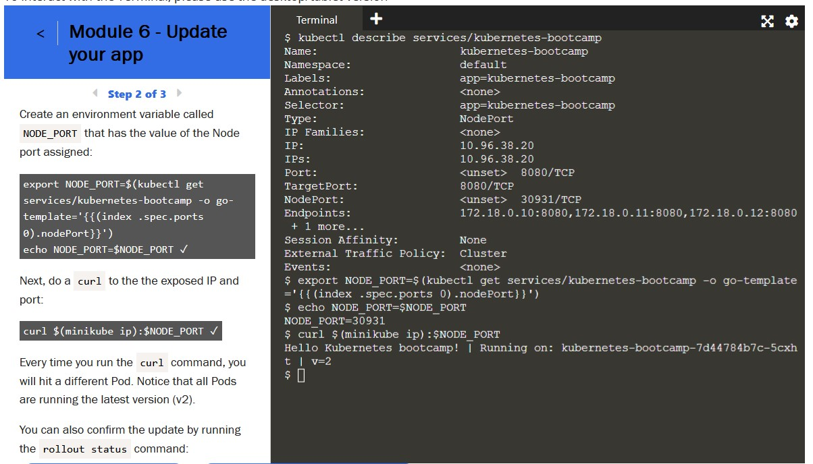

Podemos ver el status del rollout con rollout status, y también veremos la version de la imagen con describe

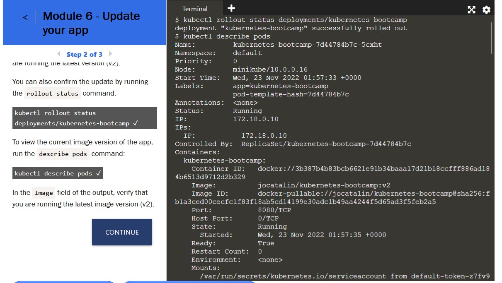

Ahora realizaremos un rollback de un update, para ello haremos un update a una imagen que nos muestra que se cayó un POD al hacer "get" y que al hacer get pods, vemos que tenemos status "imagepullbackoff" , por lo que la versión de la imagen a la que actualizamos no existia en el repositorio. Y ahora hacemos rollback con rollout undo.

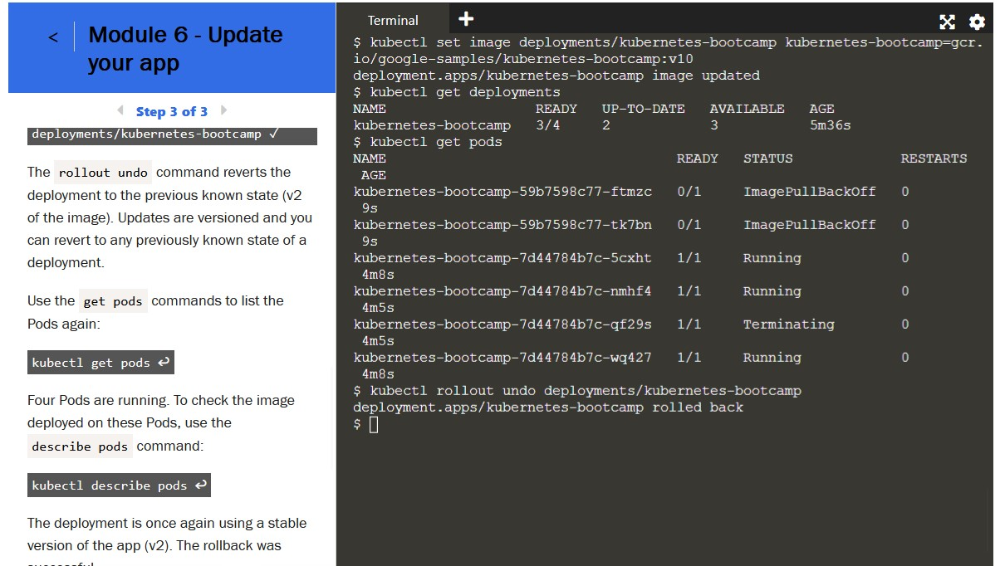

Ahora vemos con get pods que se volvio a los 4 PODS anteriores, y con describe vemos que la versión de la app es la v2.

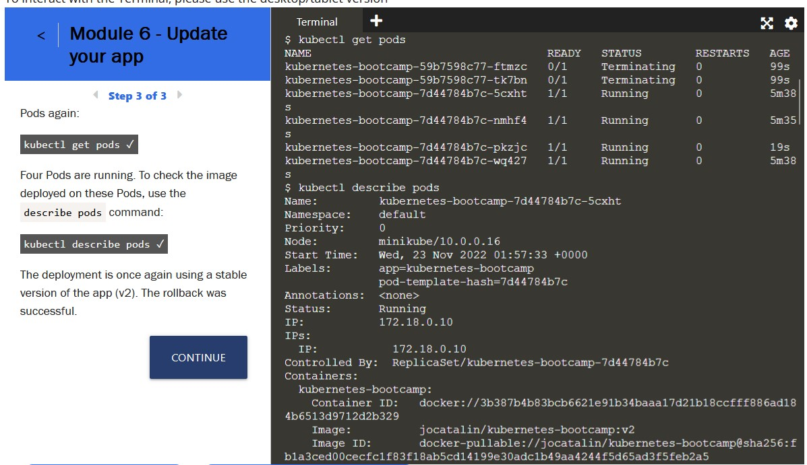